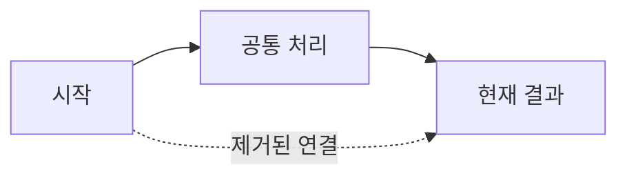

## 🔗 연관된 이슈
<!-- 이슈 번호를 입력해주세요. (예: #12) -->
<!-- 이슈가 완전히 해결되었다면 아래에 예약어를 남겨주세요. -->
- closed #이슈번호

## 📝 작업 내용

### 📌 요약

### 🔍 상세

## 🔄 변경 흐름

<!--
기존과 현재 흐름을 하나의 Mermaid 다이어그램에 작성합니다.
공통 노드는 한 번만 정의하고, 현재 연결은 실선으로 작성합니다.
제거된 기존 연결만 `-. 제거된 연결 .->` 형식의 점선으로 표시합니다.
-->

