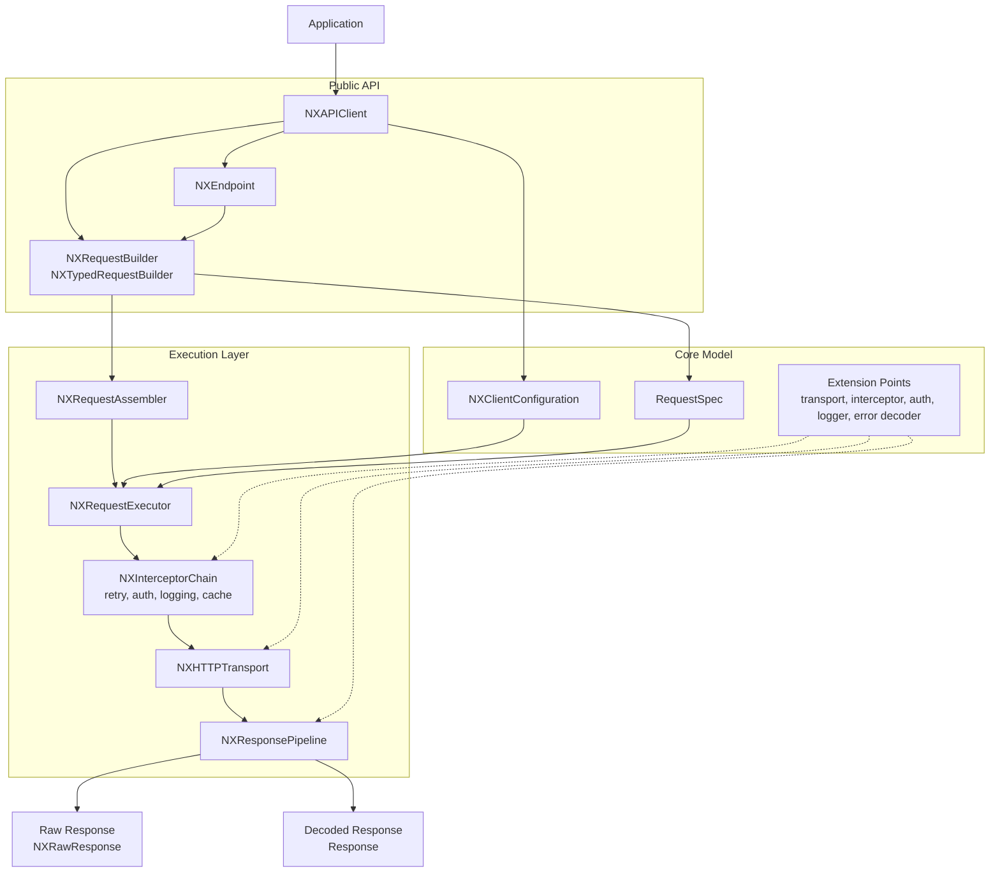

# Nexa

[](https://github.com/opficdev/Nexa/actions/workflows/build.yml)
[](https://www.swift.org)
[](https://github.com/opficdev/Nexa)
[](https://swift.org/package-manager/)

[English](README.en.md) | [한국어](README.md)

Nexa is a SwiftUI-inspired declarative networking library built on `URLSession`.

Nexa preserves HTTP semantics by defining explicit boundaries for sharing cached responses and in-flight work, deciding when failed requests may be retried, and observing `URLSession` transport. The alternatives, reasoning, and verification for each decision are documented in the [design stories (Korean)](https://github.com/opficdev/Nexa/wiki/설계-스토리).

- [Features](#features)
- [Requirements](#requirements)
- [Installation](#installation)
- [Public API](#public-api)
- [Quick Start](#quick-start)
- [Endpoint API](#endpoint-api)
- [Request Migration](#request-migration)
- [Configuration](#configuration)
- [Structured Logging](#structured-logging)
- [Error Handling](#error-handling)
- [Transport Metrics](#transport-metrics)
- [Authentication Refresh](#authentication-refresh)
- [Response Cache](#response-cache)
- [Retry Policy](#retry-policy)
- [Development](#development)
- [Testing](#testing)

## Features

- [x] Declarative request builders for `GET`, `POST`, `PUT`, `PATCH`, and `DELETE`
- [x] Typed response decoding with Swift Concurrency
- [x] Value-semantic request composition
- [x] Query, header, timeout, body, and JSON encoding support
- [x] Endpoint-based API with compile-time response typing
- [x] Request-level and global interceptor chains
- [x] Built-in authentication and token refresh flow through `NXAuthTokenProvider`
- [x] One shared in-flight token refresh for concurrent `401` responses from the same client
- [x] Retry policies with fixed and exponential backoff
- [x] Response validation and server error decoding
- [x] Memory response cache with optional validator revalidation for successful `GET` responses and in-flight identical requests
- [x] Logger hooks and transport abstraction for testing
- [x] `Sendable` URLSession task metrics observer

## Requirements

| Platform | Swift | Installation |
| --- | --- | --- |
| iOS 15.0+ / macOS 12.0+ | Swift 6.1 | [Swift Package Manager](#swift-package-manager) |

## Installation

### Swift Package Manager

Add Nexa to your `Package.swift`

```swift
dependencies: [
    .package(url: "https://github.com/opficdev/Nexa.git", branch: "main")
]
```

Then add `Nexa` to your target dependencies

```swift
.target(
    name: "AppModule",
    dependencies: [
        .product(name: "Nexa", package: "Nexa")
    ]
)
```

## Public API

Most code starts from `NXAPIClient`, then moves into one `NXRequestBuilder` request path. Use `send()` for `NXRawResponse`, `send(as:)` for an explicit decoded type, or contextual `send()` when the assignment supplies the decoded type.

The rest of the public surface is made of extension points for auth, logging, testing, retry, validation, and custom error mapping.

| API | When to use it | Example |
| --- | --- | --- |
| `NXAPIClient` | Main entry point for requests that share one `baseURL` and one configuration | `client.get("/users").send(as: User.self)` |
| `NXRequestBuilder` | When you need a prepared `URLRequest`, `NXRawResponse`, or a decoded `Decodable` response | `try await client.get("/users").send()` |
| `NXTypedRequestBuilder<Response>` | Endpoint configuration compatibility boundary | `func configure(_ builder: NXTypedRequestBuilder<User>) -> NXTypedRequestBuilder<User>` |
| `NXEndpoint` | When an endpoint definition should be reusable and carry its response type with it | `try await client.send(UserEndpoint(identifier: 1))` |
| `NXClientConfiguration` | When shared headers, transport, logger, auth, encoder, decoder, or interceptors should be configured once | `NXClientConfiguration(baseURL: url, authTokenProvider: yourAuthTokenProvider)` |
| `NXCache` | When successful unauthenticated `GET` responses should be reused for a TTL or revalidated with validators | `NXClientConfiguration(baseURL: url, cache: .revalidatingMemory(ttl: 300))` |
| `NXRetryBackoff` | When retry delays need fixed or exponential behavior | `.retry(maxAttempts: 3, backoff: .fixed(0))` |
| `NXRetryJitter` | When local retry delay randomization is needed | `.retry(maxAttempts: 3, jitter: .full)` |
| `NXValidationPolicy` | When the accepted status codes differ from the default `200..<300` | `.validate(.statusCodes([200, 201, 204]))` |
| `NXHTTPTransport` | When you need stubs in tests or want to replace the transport implementation | `NXClientConfiguration(baseURL: url, transport: yourStubTransport)` |
| `NXHTTPInterceptor` | When you need cross-cutting request behavior such as tracing or header injection | `.intercept(yourInterceptor)` |
| `NXAuthTokenProvider` | When `.authorized()` requests need token lookup and refresh support | `authTokenProvider: yourAuthTokenProvider` |
| `NXServerErrorDecoder` | When failed responses should decode into your own domain error | `serverErrorDecoder: yourServerErrorDecoder` |
| `NXLogger` | When you want structured request lifecycle logging | `logger: yourLogger` |
| `NXNetworkMetricsObserver` | When you want URLSession task timing snapshots without changing logger events | `NXURLSessionTransport(metricsObserver: yourObserver)` |
| `NXRawResponse` | When you need both `Data` and `HTTPURLResponse` directly | `let response = try await client.get("/users").send()` |
| `NXError` | When handling Nexa-specific failures in calling code | `catch let error as NXError` |
| `NXHTTPMethod` | When defining an `NXEndpoint` method | `var method: NXHTTPMethod { .post }` |

### Which one should I start with?

Assume `client` below is an `NXAPIClient` that has already been configured.

Use `NXAPIClient` + `NXRequestBuilder` for most application code

```swift
import Foundation
import Nexa

struct User: Decodable {
    let id: Int
    let name: String
}

let user = try await client
	.get("/users/42")
	.send(as: User.self)
```

When the destination type supplies the decoding context, `send()` can remain concise

```swift
let user: User = try await client
	.get("/users/42")
	.send()
```

Use `NXRequestBuilder` when you want to inspect the request or handle the raw response yourself

```swift
import Foundation
import Nexa

let request = try await client
	.post("/users")
	.header("X-Trace-Id", UUID().uuidString)
	.preparedURLRequest()
```

```swift
let response = try await client
	.get("/users")
	.send()
```

Use `NXEndpoint` when the same endpoint shape is reused in several places

```swift
import Foundation
import Nexa

struct User: Decodable {
    let id: Int
    let name: String
}

struct UserEndpoint: NXEndpoint {
    let identifier: Int

    var method: NXHTTPMethod { .get }
    var path: String { "/users/\(identifier)" }

    func configure(_ builder: NXTypedRequestBuilder<User>) -> NXTypedRequestBuilder<User> {
		builder.query("include", "profile")
	}
}
```

Use the lower-level protocols only when the default behavior is not enough:

- `NXHTTPTransport`: stubs, mocks, custom network backends
- `NXHTTPInterceptor`: tracing, request mutation, custom flow control
- `NXAuthTokenProvider`: bearer token injection and refresh
- `NXServerErrorDecoder`: server payload to domain error mapping
- `NXLogger`: request lifecycle logging and observability
- `NXNetworkMetricsObserver`: URLSession task timing snapshots

## Request Flow



## Quick Start

Nexa keeps request code compact while still exposing auth, retry, validation, and decoding in one flow.

```swift
import Foundation
import Nexa

struct User: Decodable {
    let id: Int
    let name: String
}

let client = NXAPIClient(
    configuration: NXClientConfiguration(
        baseURL: URL(string: "https://api.example.com")!
    )
)

let user = try await client
	.get("/users/me")
	.query("include", "profile")
	.accept("application/json")
	.send(as: User.self)
```

Add `.authorized()` only when the client has an `authTokenProvider`.

You can also build requests step by step

```swift
import Foundation
import Nexa

struct CreateUserPayload: Encodable {
    let name: String
}

struct User: Decodable {
    let id: Int
    let name: String
}

let createdUser = try await client
	.post("/users")
	.header("X-Trace-Id", UUID().uuidString)
	.json(CreateUserPayload(name: "opfic"))
	.send(as: User.self)
```

### Request Paths

A relative path is appended to the existing path in `baseURL`, and builder query items are appended to its existing query. Calling `client.get()` without a path requests the path already contained in `baseURL`.

A string containing an absolute URL with a scheme replaces `baseURL`, and builder query items are appended after the URL's existing query.

> [!WARNING]
> Client-wide and request headers and global and request interceptors still apply to an absolute URL. An `.authorized()` request also applies its Bearer token. Use absolute URLs only for trusted hosts, and do not send a cross-host absolute URL through a client configured with authentication or sensitive headers.

## Endpoint API

If you prefer a Moya-style endpoint abstraction, define an `NXEndpoint` and let Nexa keep the response type attached to the endpoint itself. Its `NXTypedRequestBuilder` configuration contract remains available for source compatibility.

```swift
import Foundation
import Nexa

struct User: Decodable {
    let id: Int
    let name: String
}

struct UserEndpoint: NXEndpoint {
    let identifier: Int

    var method: NXHTTPMethod { .get }
    var path: String { "/users/\(identifier)" }

    func configure(_ builder: NXTypedRequestBuilder<User>) -> NXTypedRequestBuilder<User> {
		builder
			.query("include", "profile")
			.accept("application/json")
	}
}

let user = try await client.send(UserEndpoint(identifier: 42))
```

## Request Migration

Nexa 1.3 keeps the existing request APIs available while establishing `NXRequestBuilder` as the one-way method-based request path.

| Removed call | Replacement |
| --- | --- |
| `client.get("/users").raw()` | `client.get("/users").send()` |
| `client.get("/users", as: User.self).raw()` | `client.get("/users").send()` |
| `client.get("/users").as(User.self).send()` | `client.get("/users").send(as: User.self)` |
| `client.get("/users", as: User.self).send()` | `client.get("/users").send(as: User.self)` |

Nexa 1.3 removes `NXRequestBuilder.raw()` and `NXTypedRequestBuilder.raw()`. The existing `NXEndpoint.configure(_:)` and `client.send(endpoint)` contracts remain unchanged, but Endpoint requests do not provide a raw-response execution API. Construct a direct `NXRequestBuilder` request when raw response handling is required. This migration does not change empty-body or `204` response behavior.

## Configuration

`NXClientConfiguration` centralizes the pieces that usually spread across a custom API layer.

```swift
import Foundation
import Nexa

let configuration = NXClientConfiguration(
    baseURL: URL(string: "https://api.example.com")!,
    headers: [
        "Accept": "application/json"
    ],
    transport: NXURLSessionTransport(),
    logger: NXNoopLogger(),
    interceptors: [],
    cache: .memory(ttl: 0.3),
    serverErrorDecoder: NXDefaultServerErrorDecoder(),
    authTokenProvider: nil
)

let client = NXAPIClient(configuration: configuration)
```

Replace the defaults with your own conforming types only when you need custom behavior:

- `NXLogger` for structured logging
- `NXHTTPInterceptor` for request tracing or mutation
- `NXServerErrorDecoder` for mapping failed responses to domain errors
- `NXAuthTokenProvider` for bearer token injection and refresh

Nexa currently supports:

- Global headers and per-request headers
- Raw body and JSON body encoding
- Request-level validation policies
- In-memory reuse of successful unauthenticated `GET` responses within a TTL
- In-flight identical `GET` request reuse while the first request is still running
- Automatic auth header injection for `authorized()` requests
- Token refresh and retry handling
- Custom transports for stubbing and isolated tests

## Structured Logging

`NXLogger` connects one logical request through `requestIdentifier` and reports the retry-policy attempt through `attemptNumber`. Attempt numbers start at 1 and do not increase when a request is replayed after a Bearer token refresh.

| Event | When emitted | Main values |
| --- | --- | --- |
| `requestStart` | Before execution below the logger | Request identifier, attempt number, method, URL, headers |
| `requestEnd` | When execution below the logger returns a response | Request identifier, attempt number, status code, elapsed time, payload size |
| `requestFailure` | When a lower interceptor or transport throws | Request identifier, attempt number, elapsed time, error description |
| `retry` | When the next retry attempt is scheduled | Request identifier, next attempt number, delay |
| `authRefresh` | When an actual Bearer token refresh completes | Identifier of the request that started the refresh, success state |

Only `Authorization` and `Cookie` values in `requestStart` headers are replaced with `<redacted>`, regardless of header-name casing. URL queries, error descriptions, and other custom sensitive headers are not redacted automatically and require protection before they reach the logger.

Request execution awaits `NXLogger.log(_:)`. A slow logger can therefore delay request execution, retry scheduling, or authentication refresh. Response validation and decoding occur after the logger, so `requestFailure` does not represent every final `NXError`.

## Error Handling

Public Nexa requests classify errors from request assembly, authentication, transport, response validation, and decoding as `NXError`.

| Case | When it occurs |
| --- | --- |
| `invalidRequest` | URL assembly fails or an interceptor changes the HTTP method |
| `authenticationRequired` | An authenticated request cannot obtain a current Bearer token |
| `authProviderUnavailable` | `.authorized()` is used without an `NXAuthTokenProvider` |
| `timeout` | `URLError.timedOut` occurs |
| `cancelled` | `URLError.cancelled` or Swift Task cancellation occurs |
| `transport` | A `URLError` other than timeout or cancellation occurs |
| `invalidStatus` | The response status is rejected by validation and is not converted into a custom server error |
| `server` | `NXServerErrorDecoder` converts a response rejected by the validation policy into a custom error |
| `decoding` | A successful response cannot be decoded into the requested `Decodable` type |
| `unknown` | An error does not match any category above |

When the response validation policy rejects a status code, `NXServerErrorDecoder` runs first. The result maps to `server` when the decoder returns an error and to `invalidStatus` otherwise.

## Transport Metrics

`NXURLSessionTransport` can forward one `NXNetworkMetrics` snapshot to an `NXNetworkMetricsObserver` for each `URLSession` task. The snapshot contains task duration, redirect count, transaction count, and ordered `NXNetworkTransactionMetrics` values.

Each transaction reports DNS, connection, TLS, and request-to-first-byte durations only when both Foundation timestamps exist. A missing timestamp remains `nil`. A reused connection is represented by `isConnectionReused` and can have `nil` DNS or connection durations.

```swift
import Foundation
import Nexa

actor MetricsObserver: NXNetworkMetricsObserver {
	func record(_ metrics: NXNetworkMetrics) async {
		print(metrics.taskDuration ?? 0)
	}
}

let transport = NXURLSessionTransport(metricsObserver: MetricsObserver())
```

Only `NXURLSessionTransport` collects these snapshots. A custom `NXHTTPTransport` and a cache hit do not synthesize metrics. Observer delivery does not delay request completion, and its order relative to `NXLogger` events is not guaranteed.

## Authentication Refresh

Concurrent `401` responses from `.authorized()` requests created by one `NXAPIClient` share one in-progress token refresh. Copies of that client and builders derived from it share the same refresh. A separately initialized `NXAPIClient` has an independent refresh lifetime.

`NXAuthTokenProvider` keeps the same `currentAccessToken()` and `refreshAccessToken()` requirements. Each request retries at most once after a non-`nil` refresh result. For a `nil` refresh result, the authentication interceptor preserves the original `401` response, but a public `send()` using default response validation can map it to `NXError.invalidStatus`. A refresh error follows Nexa's existing error mapping.

Cancelling one caller does not cancel the shared refresh or the other waiting requests. `NXAuthRefreshLog` is emitted once per actual refresh; its `requestIdentifier` is the identifier of the request that started that refresh.

## Response Cache

`NXCache.memory(ttl:)` reuses successful unauthenticated `GET` responses for the given TTL and combines identical requests while the first request is in progress. It does not add conditional headers after the TTL expires.

`NXCache.revalidatingMemory(ttl:)` keeps the same cache behavior and additionally revalidates an expired cached `200` response when it has an `ETag` or `Last-Modified` header. Nexa adds `If-None-Match` and `If-Modified-Since` after creating the cache key. A bodyless `304 Not Modified` with the matching validator returns the cached body as a `200` response. A different validator or a body-bearing `304` discards the stale response and follows normal response validation. A changed `200` replaces the cached body and validator. Cached `201`, `204`, and other successful non-`200` responses keep the normal TTL-expiry reload path.

```swift
let client = NXAPIClient(
	configuration: NXClientConfiguration(
		baseURL: URL(string: "https://api.example.com")!,
		cache: .revalidatingMemory(ttl: 300)
	)
)
```

The cache and in-flight request store belong to an `NXAPIClient` instance. Keep a client in a service or dependency container when requests should share cache state. Creating a new `NXAPIClient(configuration:)` creates an independent store. A copy of an existing client value shares the original store.

```swift
struct UserService {
	private let client: NXAPIClient

	init(client: NXAPIClient) {
		self.client = client
	}
}
```

Nexa does not implement `Vary`, disk cache, full `Cache-Control` interpretation, or stale-if-error behavior. Adding `.revalidatingMemory(ttl:)` adds an `NXCache` enum case, so update exhaustive `switch` statements over `NXCache` when recompiling.

## Retry Policy

`.retry(...)` retries `GET`, `HEAD`, `PUT`, `DELETE`, and `OPTIONS` by default when a configured retryable status code or transport error occurs. It uses three attempts when `maxAttempts` is omitted. `POST` and `PATCH` remain single-attempt requests unless you explicitly add them through `allowing` for an endpoint that safely accepts repeated requests.

For retryable `429` and `503` responses, Nexa accepts `Retry-After` delay seconds and HTTP-date values. A valid server value replaces local backoff, is capped by `maximumServerDelay` (60 seconds by default), and is recorded through `NXRetryLog`. `NXRetryJitter.full` changes only local backoff delays and never shortens a server-provided delay.

```swift
let user = try await client
	.post("/users")
	.retry(
		maxAttempts: 3,
		backoff: .fixed(0),
		allowing: [.post],
		maximumServerDelay: 30,
		jitter: .none
	)
	.send(as: User.self)
```

## Nexa 1.3 Migration

The public `NXRetryPolicy` constructor, `NXRetryPolicy.Backoff`, `NXRetryPolicy.Jitter`, and `.retry(_:)` are removed in Nexa 1.3. Nexa keeps `NXRetryPolicy` as an internal implementation detail. Use `.retry(maxAttempts:backoff:retryableStatusCodes:allowing:maximumServerDelay:jitter:)` with `NXRetryBackoff` and `NXRetryJitter` instead; `maxAttempts` defaults to `3`.

## Interceptor Method Contract

`NXHTTPInterceptor.replacingRequest(_:)` can change a request URL, headers, and body, but the request method must remain equal to the configured method. A different method ends the chain with `NXError.invalidRequest` before later interceptors, logging, caching, or transport.

`NXRequestExecutionContext.requestIdentifier` remains stable for one logical request and its retry attempts. `attemptNumber` starts at 1 and represents the retry-policy attempt; it does not increase when a request is replayed after a Bearer token refresh.

## Development

Nexa keeps SwiftLint out of the distributable package graph so package consumers do not inherit maintainer lint rules.

For local library development, use `Examples/NexaClient/NexaClient.xcodeproj`.

- Build the `NexaClient` target in Xcode to validate the local package integration path
- The app target runs `swiftlint` against the repository root during build
- If `swiftlint` is missing locally, the script phase fails with an installation hint

This project is a maintainer-only integration host. It is not required for apps that depend on Nexa through Swift Package Manager.

## Testing

Nexa was designed to keep request execution testable. `NXHTTPTransport` lets you replace live networking with a custom transport and validate the outgoing request and decoded response.

```swift
import Foundation
import Nexa

struct User: Codable, Equatable {
    let id: Int
    let name: String
}

struct StubTransport: NXHTTPTransport {
    func send(_ request: URLRequest) async throws -> NXRawResponse {
        let response = HTTPURLResponse(
            url: request.url!,
            statusCode: 200,
            httpVersion: nil,
            headerFields: nil
        )!

        return NXRawResponse(
            data: Data(#"{"id":1,"name":"opfic"}"#.utf8),
            response: response
        )
    }
}

let client = NXAPIClient(
    configuration: NXClientConfiguration(
        baseURL: URL(string: "https://example.com")!,
        transport: StubTransport()
    )
)

let user = try await client.get("/users/1").send(as: User.self)
```
