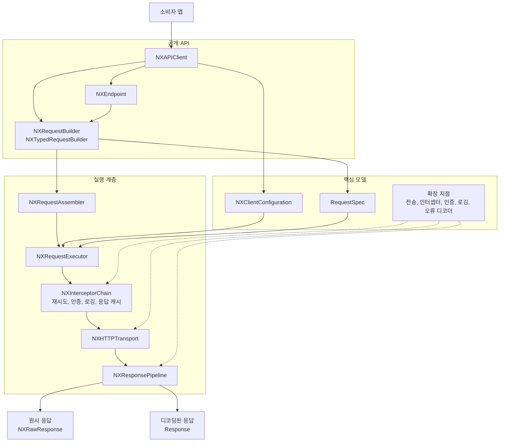

# Nexa

[](https://github.com/opficdev/Nexa/actions/workflows/build.yml)
[](https://www.swift.org)
[](https://github.com/opficdev/Nexa)
[](https://swift.org/package-manager/)

[English](README.en.md) | [한국어](README.md)

Nexa는 `URLSession` 기반의 SwiftUI 스타일 선언형 네트워킹 라이브러리입니다.

Nexa는 HTTP 의미를 보존하기 위해 캐시 응답과 진행 중 작업의 공유 범위, 실패한 요청의 재시도 조건, `URLSession` 전송 관측의 경계를 명시합니다. 각 선택의 대안과 근거, 검증 결과는 [설계 스토리](https://github.com/opficdev/Nexa/wiki/설계-스토리)에 정리했습니다.

- [기능](#기능)
- [요구 사항](#요구-사항)
- [설치](#설치)
- [공개 API](#공개-api)
- [빠른 시작](#빠른-시작)
- [Endpoint API](#endpoint-api)
- [요청 전환](#요청-전환)
- [설정](#설정)
- [전송 측정값](#전송-측정값)
- [인증 토큰 갱신](#인증-토큰-갱신)
- [응답 캐시](#응답-캐시)
- [재시도 정책](#재시도-정책)
- [개발](#개발)
- [테스트](#테스트)

## 기능

- [x] `GET`, `POST`, `PUT`, `PATCH`, `DELETE`를 위한 선언형 요청 빌더
- [x] Swift Concurrency를 활용한 타입 안전 응답 디코딩
- [x] 값 타입 기반 요청 조합
- [x] 쿼리, 헤더, 타임아웃, 바디, JSON 인코딩 지원
- [x] 컴파일 타임 응답 타입을 갖는 Endpoint 기반 API
- [x] 요청 단위 및 전역 인터셉터 체인
- [x] `NXAuthTokenProvider`를 통한 인증 및 토큰 갱신 흐름 내장
- [x] 같은 client의 동시 `401` 응답을 위한 진행 중 토큰 갱신 공유
- [x] Fixed backoff 및 exponential backoff 기반 재시도 정책
- [x] 응답 유효성 검사 및 서버 에러 디코딩
- [x] 성공한 `GET` 응답과 진행 중인 동일 요청을 위한 validator 재검증을 지원하는 메모리 응답 캐시
- [x] 로거 훅 및 테스트를 위한 transport 추상화
- [x] `Sendable` URLSession task metrics observer

## 요구 사항

| 플랫폼 | Swift | 설치 |
| --- | --- | --- |
| iOS 15.0+ / macOS 12.0+ | Swift 6.1 | [Swift Package Manager](#swift-package-manager) |

## 설치

### Swift Package Manager

`Package.swift`에 Nexa를 추가하세요:

```swift
dependencies: [
    .package(url: "https://github.com/opficdev/Nexa.git", branch: "main")
]
```

그런 다음 타겟 의존성에 `Nexa`를 추가하세요:

```swift
.target(
    name: "AppModule",
    dependencies: [
        .product(name: "Nexa", package: "Nexa")
    ]
)
```

## 공개 API

대부분의 코드는 `NXAPIClient`에서 시작하여 하나의 `NXRequestBuilder` 요청 경로로 이어집니다. `NXRawResponse`에는 `send()`, 명시적 디코딩 타입에는 `send(as:)`, 대입문이 타입을 제공할 때는 문맥 기반 `send()`를 사용합니다.

나머지 공개 인터페이스는 인증, 로깅, 테스트, 재시도, 유효성 검사, 커스텀 에러 매핑을 위한 확장 포인트로 구성됩니다.

| API | 사용 시점 | 예시 |
| --- | --- | --- |
| `NXAPIClient` | 동일한 `baseURL`과 설정을 공유하는 요청의 주 진입점 | `client.get("/users").send(as: User.self)` |
| `NXRequestBuilder` | `URLRequest`, `NXRawResponse`, 또는 디코딩된 `Decodable` 응답이 필요할 때 | `try await client.get("/users").send()` |
| `NXTypedRequestBuilder<Response>` | Endpoint 설정 호환성 경계 | `func configure(_ builder: NXTypedRequestBuilder<User>) -> NXTypedRequestBuilder<User>` |
| `NXEndpoint` | 엔드포인트 정의를 재사용하고 응답 타입을 함께 관리할 때 | `try await client.send(UserEndpoint(identifier: 1))` |
| `NXClientConfiguration` | 공통 헤더, transport, 로거, 인증, 인코더, 디코더, 인터셉터를 한 번에 설정할 때 | `NXClientConfiguration(baseURL: url, authTokenProvider: yourAuthTokenProvider)` |
| `NXCache` | 인증이 필요 없는 성공한 `GET` 응답을 TTL 동안 재사용하거나 validator로 재검증할 때 | `NXClientConfiguration(baseURL: url, cache: .revalidatingMemory(ttl: 300))` |
| `NXRetryBackoff` | 고정 또는 지수 재시도 지연이 필요할 때 | `.retry(maxAttempts: 3, backoff: .fixed(0))` |
| `NXRetryJitter` | local 재시도 지연의 무작위 처리가 필요할 때 | `.retry(maxAttempts: 3, jitter: .full)` |
| `NXValidationPolicy` | 허용할 상태 코드가 기본값(`200..<300`)과 다를 때 | `.validate(.statusCodes([200, 201, 204]))` |
| `NXHTTPTransport` | 테스트용 스텁이 필요하거나 transport 구현을 교체할 때 | `NXClientConfiguration(baseURL: url, transport: yourStubTransport)` |
| `NXHTTPInterceptor` | 트레이싱이나 헤더 주입처럼 요청 전반에 적용되는 처리가 필요할 때 | `.intercept(yourInterceptor)` |
| `NXAuthTokenProvider` | `.authorized()` 요청에 토큰 조회 및 갱신 기능이 필요할 때 | `authTokenProvider: yourAuthTokenProvider` |
| `NXServerErrorDecoder` | 실패 응답을 도메인 에러로 디코딩할 때 | `serverErrorDecoder: yourServerErrorDecoder` |
| `NXLogger` | 구조화된 요청 생명주기 로깅이 필요할 때 | `logger: yourLogger` |
| `NXNetworkMetricsObserver` | logger event 변경 없이 URLSession task 시간 snapshot이 필요할 때 | `NXURLSessionTransport(metricsObserver: yourObserver)` |
| `NXRawResponse` | `Data`와 `HTTPURLResponse`를 직접 다뤄야 할 때 | `let response = try await client.get("/users").send()` |
| `NXError` | 호출 코드에서 Nexa 고유 오류를 처리할 때 | `catch let error as NXError` |
| `NXHTTPMethod` | `NXEndpoint`의 메서드를 정의할 때 | `var method: NXHTTPMethod { .post }` |

### 어디서 시작할까요?

아래에서 `client`는 이미 설정된 `NXAPIClient`라고 가정합니다.

대부분의 앱 코드에서는 `NXAPIClient`와 `NXRequestBuilder` 조합을 사용할 수 있습니다.

```swift
import Foundation
import Nexa

struct User: Decodable {
    let id: Int
    let name: String
}

let user = try await client
	.get("/users/42")
	.send(as: User.self)
```

대입 대상 타입이 디코딩 문맥을 제공하면 `send()`를 간결하게 유지할 수 있습니다.

```swift
let user: User = try await client
	.get("/users/42")
	.send()
```

요청을 직접 확인하거나 원시 응답을 직접 처리할 때는 `NXRequestBuilder`를 사용하면 됩니다.

```swift
import Foundation
import Nexa

let request = try await client
	.post("/users")
	.header("X-Trace-Id", UUID().uuidString)
	.preparedURLRequest()
```

```swift
let response = try await client
	.get("/users")
	.send()
```

동일한 엔드포인트 형태가 여러 곳에서 재사용될 때는 `NXEndpoint`를 사용하면 됩니다.

```swift
import Foundation
import Nexa

struct User: Decodable {
    let id: Int
    let name: String
}

struct UserEndpoint: NXEndpoint {
    let identifier: Int

    var method: NXHTTPMethod { .get }
    var path: String { "/users/\(identifier)" }

    func configure(_ builder: NXTypedRequestBuilder<User>) -> NXTypedRequestBuilder<User> {
		builder.query("include", "profile")
	}
}
```

기본 동작으로 충분하지 않을 때만 하위 레벨 프로토콜을 사용하면 됩니다.

- `NXHTTPTransport`: 스텁, 목, 커스텀 네트워크 백엔드
- `NXHTTPInterceptor`: 트레이싱, 요청 변환, 커스텀 흐름 제어
- `NXAuthTokenProvider`: bearer token 주입 및 갱신
- `NXServerErrorDecoder`: 서버 payload를 도메인 에러로 매핑
- `NXLogger`: 요청 생명주기 로깅 및 관측성
- `NXNetworkMetricsObserver`: URLSession task 시간 snapshot

## 요청 흐름



## 빠른 시작

Nexa는 인증, 재시도, 유효성 검사, 디코딩을 하나의 흐름으로 간결하게 표현합니다.

```swift
import Foundation
import Nexa

struct User: Decodable {
    let id: Int
    let name: String
}

let client = NXAPIClient(
    configuration: NXClientConfiguration(
        baseURL: URL(string: "https://api.example.com")!
    )
)

let user = try await client
	.get("/users/me")
	.query("include", "profile")
	.accept("application/json")
	.send(as: User.self)
```

`.authorized()`는 클라이언트에 `authTokenProvider`가 설정된 경우에만 추가하세요.

단계별로 요청을 구성할 수도 있습니다:

```swift
import Foundation
import Nexa

struct CreateUserPayload: Encodable {
    let name: String
}

struct User: Decodable {
    let id: Int
    let name: String
}

let createdUser = try await client
	.post("/users")
	.header("X-Trace-Id", UUID().uuidString)
	.json(CreateUserPayload(name: "opfic"))
	.send(as: User.self)
```

## Endpoint API

Moya 스타일의 엔드포인트 추상화를 선호한다면, `NXEndpoint`를 정의하여 응답 타입을 엔드포인트에 직접 연결할 수 있습니다. `NXTypedRequestBuilder` 설정 계약은 소스 호환성을 위해 유지됩니다.

```swift
import Foundation
import Nexa

struct User: Decodable {
    let id: Int
    let name: String
}

struct UserEndpoint: NXEndpoint {
    let identifier: Int

    var method: NXHTTPMethod { .get }
    var path: String { "/users/\(identifier)" }

    func configure(_ builder: NXTypedRequestBuilder<User>) -> NXTypedRequestBuilder<User> {
		builder
			.query("include", "profile")
			.accept("application/json")
	}
}

let user = try await client.send(UserEndpoint(identifier: 42))
```

## 요청 전환

Nexa 1.3은 기존 요청 API를 유지하면서 `NXRequestBuilder`를 단방향 method 기반 요청 경로로 구성합니다.

| 제거된 호출 | 대체 호출 |
| --- | --- |
| `client.get("/users").raw()` | `client.get("/users").send()` |
| `client.get("/users", as: User.self).raw()` | `client.get("/users").send()` |
| `client.get("/users").as(User.self).send()` | `client.get("/users").send(as: User.self)` |
| `client.get("/users", as: User.self).send()` | `client.get("/users").send(as: User.self)` |

Nexa 1.3은 `NXRequestBuilder.raw()`와 `NXTypedRequestBuilder.raw()`를 제거합니다. 기존 `NXEndpoint.configure(_:)`와 `client.send(endpoint)` 계약은 유지하지만 Endpoint 요청에는 원시 응답 실행 API가 없습니다. 원시 응답 처리가 필요하면 `NXRequestBuilder`로 요청을 직접 구성해야 합니다. 이 전환은 빈 바디와 `204` 응답 동작을 변경하지 않습니다.

## 설정

`NXClientConfiguration`은 커스텀 API 레이어에 흩어지기 쉬운 설정을 한 곳에 집중시킵니다.

```swift
import Foundation
import Nexa

let configuration = NXClientConfiguration(
    baseURL: URL(string: "https://api.example.com")!,
    headers: [
        "Accept": "application/json"
    ],
    transport: NXURLSessionTransport(),
    logger: NXNoopLogger(),
    interceptors: [],
    cache: .memory(ttl: 0.3),
    serverErrorDecoder: NXDefaultServerErrorDecoder(),
    authTokenProvider: nil
)

let client = NXAPIClient(configuration: configuration)
```

커스텀 동작이 필요할 때만 기본값을 직접 구현한 타입으로 교체하세요:

- `NXLogger`: 구조화된 로깅
- `NXHTTPInterceptor`: 요청 트레이싱 또는 변환
- `NXServerErrorDecoder`: 실패 응답을 도메인 에러로 매핑
- `NXAuthTokenProvider`: bearer token 주입 및 갱신

현재 Nexa가 지원하는 기능:

- 전역 헤더 및 요청별 헤더
- 원시 바디 및 JSON 바디 인코딩
- 요청 단위 유효성 검사 정책
- 성공한 비인증 `GET` 응답의 TTL 내 memory 재사용
- 첫 요청이 실행 중일 때 진행 중인 동일 `GET` 요청 재사용
- `.authorized()` 요청에 대한 자동 인증 헤더 주입
- 토큰 갱신 및 재시도 처리
- 스터빙 및 격리 테스트를 위한 커스텀 transport

## 전송 측정값

`NXURLSessionTransport`는 `URLSession` task마다 `NXNetworkMetrics` snapshot 하나를 `NXNetworkMetricsObserver`에 전달할 수 있습니다. snapshot에는 task duration, redirect 수, transaction 수, 수집 순서를 보존한 `NXNetworkTransactionMetrics` 값이 포함됩니다.

각 transaction은 Foundation timestamp의 시작과 끝이 모두 있을 때만 DNS, connection, TLS, request 시작부터 first byte까지의 duration을 나타냅니다. timestamp가 없으면 해당 값은 `nil`입니다. 재사용 connection은 `isConnectionReused`로 나타내며 DNS 또는 connection duration이 `nil`일 수 있습니다.

```swift
import Foundation
import Nexa

actor MetricsObserver: NXNetworkMetricsObserver {
	func record(_ metrics: NXNetworkMetrics) async {
		print(metrics.taskDuration ?? 0)
	}
}

let transport = NXURLSessionTransport(metricsObserver: MetricsObserver())
```

snapshot은 `NXURLSessionTransport`만 수집합니다. 커스텀 `NXHTTPTransport`와 cache hit는 metrics를 합성하지 않습니다. observer 전달은 요청 완료를 지연하지 않으며 `NXLogger` event와의 순서는 보장하지 않습니다.

## 인증 토큰 갱신

하나의 `NXAPIClient`에서 생성한 `.authorized()` 요청이 동시에 `401` 응답을 받으면 진행 중인 토큰 갱신 결과 하나를 공유합니다. 해당 client의 값 복사본과 여기서 파생한 builder도 같은 갱신을 공유합니다. 별도로 생성한 `NXAPIClient`는 독립된 갱신 수명을 가집니다.

`NXAuthTokenProvider`의 `currentAccessToken()`, `refreshAccessToken()` 요구 사항은 바뀌지 않습니다. 각 요청은 `nil`이 아닌 갱신 결과 뒤 최대 한 번만 재전송합니다. `nil` 갱신 결과는 해당 요청의 원래 `401` 응답을 반환하고, 갱신 오류는 Nexa의 기존 오류 매핑을 따릅니다.

한 호출자의 취소는 공유 갱신이나 다른 대기 요청을 취소하지 않습니다. `NXAuthRefreshLog`는 실제 갱신 한 번당 한 번 기록되고, `requestIdentifier`는 해당 갱신을 시작한 요청의 식별자입니다.

## 응답 캐시

`NXCache.memory(ttl:)`는 인증이 필요 없는 성공한 `GET` 응답을 지정한 TTL 동안 재사용하고, 첫 요청이 진행 중인 동일 요청을 하나로 합칩니다. TTL 만료 뒤에는 조건부 header를 추가하지 않습니다.

`NXCache.revalidatingMemory(ttl:)`는 같은 cache 동작에 더해 `ETag` 또는 `Last-Modified` header가 있는 만료 `200` 응답을 재검증합니다. Nexa는 cache key 생성 뒤 `If-None-Match`, `If-Modified-Since`를 추가합니다. validator가 일치하고 body가 없는 `304 Not Modified`는 cached body를 `200` 응답으로 반환합니다. validator가 다르거나 body가 있는 `304`는 만료 응답을 제거하고 일반 응답 유효성 검사로 처리합니다. 변경된 `200`은 cached body와 validator를 교체합니다. cached `201`, `204`와 다른 성공 non-`200` 응답은 기존 TTL 만료 뒤 무조건 요청 경로를 유지합니다.

```swift
let client = NXAPIClient(
	configuration: NXClientConfiguration(
		baseURL: URL(string: "https://api.example.com")!,
		cache: .revalidatingMemory(ttl: 300)
	)
)
```

cache와 진행 중인 요청 store는 `NXAPIClient` 인스턴스에 속합니다. 요청 간 cache 상태를 공유하려면 service 또는 의존성 주입 계층에 client를 저장해 재사용해야 합니다. `NXAPIClient(configuration:)`를 새로 만들면 독립 store가 생성됩니다. 기존 client 값의 복사본은 원래 store를 공유합니다.

```swift
struct UserService {
	private let client: NXAPIClient

	init(client: NXAPIClient) {
		self.client = client
	}
}
```

Nexa는 `Vary`, disk cache, 전체 `Cache-Control` 해석, stale-if-error를 구현하지 않습니다. `.revalidatingMemory(ttl:)`는 `NXCache` enum case를 추가하므로 `NXCache`의 모든 case를 나열한 `switch`는 재컴파일 시 새 case를 처리해야 합니다.

## 재시도 정책

`.retry(...)`는 설정한 재시도 상태 코드 또는 전송 오류가 발생하면 기본으로 `GET`, `HEAD`, `PUT`, `DELETE`, `OPTIONS`를 재시도합니다. `maxAttempts`를 생략하면 세 번 시도합니다. 같은 요청을 반복해도 안전하게 처리하는 엔드포인트일 때만 `POST`, `PATCH`를 `allowing`에 명시적으로 추가할 수 있습니다.

재시도 가능한 `429`, `503` 응답에서는 `Retry-After`의 초 단위와 HTTP-date 값을 처리합니다. 유효한 서버 값은 local backoff를 대체하고 기본 60초인 `maximumServerDelay`로 제한되며 `NXRetryLog`에 기록됩니다. `NXRetryJitter.full`은 local backoff에만 적용되고 서버가 지정한 지연을 줄이지 않습니다.

```swift
let user = try await client
	.post("/users")
	.retry(
		maxAttempts: 3,
		backoff: .fixed(0),
		allowing: [.post],
		maximumServerDelay: 30,
		jitter: .none
	)
	.send(as: User.self)
```

## Nexa 1.3 전환

Nexa 1.3에서는 공개 `NXRetryPolicy` 생성자, `NXRetryPolicy.Backoff`, `NXRetryPolicy.Jitter`, `.retry(_:)`를 제거합니다. `NXRetryPolicy`는 internal 구현 타입으로 유지합니다. `NXRetryBackoff`, `NXRetryJitter`와 `.retry(maxAttempts:backoff:retryableStatusCodes:allowing:maximumServerDelay:jitter:)`를 사용하며 `maxAttempts`의 기본값은 `3`입니다.

## Interceptor 메서드 계약

`NXHTTPInterceptor.replacingRequest(_:)`는 request URL, header, body를 바꿀 수 있지만 method는 설정한 method와 같아야 합니다. 다른 method는 이후 interceptor, logger, cache, transport 실행 전에 `NXError.invalidRequest`로 종료됩니다.

## 개발

Nexa는 배포되는 package graph에서 SwiftLint를 분리하여 패키지 소비자가 maintainer용 lint 규칙을 함께 받지 않도록 구성합니다.

로컬 라이브러리 개발 시에는 `Examples/NexaClient/NexaClient.xcodeproj`를 사용하면 됩니다.

- Xcode에서 `NexaClient` 타깃을 build하여 local package integration 경로를 확인
- app target build 시 repo 루트 기준으로 `swiftlint` 실행
- 로컬에 `swiftlint`가 없으면 script phase가 설치 안내와 함께 실패

이 project는 라이브러리 개발 전용 통합 프로젝트이며 Swift Package Manager로 Nexa를 사용하는 앱에는 필요하지 않습니다.

## 테스트

Nexa는 요청 실행을 테스트하기 쉽도록 설계되었습니다. `NXHTTPTransport`를 통해 실제 네트워킹을 커스텀 transport로 교체하고 발신 요청과 디코딩된 응답을 검증할 수 있습니다.

```swift
import Foundation
import Nexa

struct User: Codable, Equatable {
    let id: Int
    let name: String
}

struct StubTransport: NXHTTPTransport {
    func send(_ request: URLRequest) async throws -> NXRawResponse {
        let response = HTTPURLResponse(
            url: request.url!,
            statusCode: 200,
            httpVersion: nil,
            headerFields: nil
        )!

        return NXRawResponse(
            data: Data(#"{"id":1,"name":"opfic"}"#.utf8),
            response: response
        )
    }
}

let client = NXAPIClient(
    configuration: NXClientConfiguration(
        baseURL: URL(string: "https://example.com")!,
        transport: StubTransport()
    )
)

let user = try await client.get("/users/1").send(as: User.self)
```
